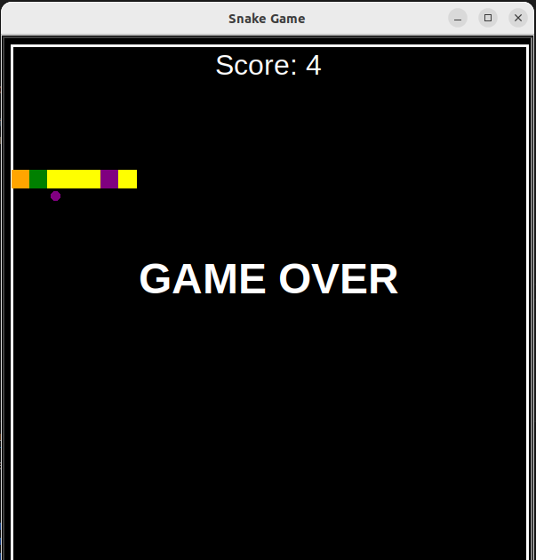
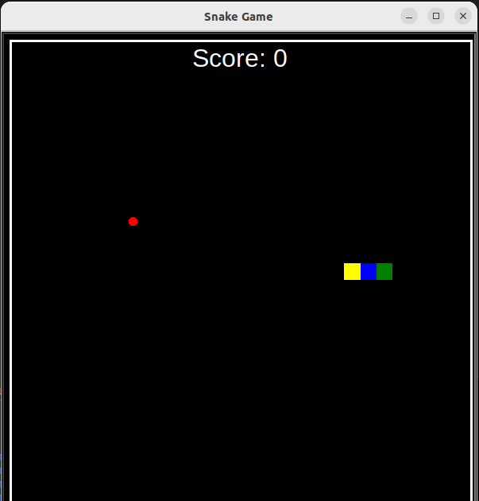

# Snake Game

An enhanced version of the classic Snake game built using Python and the Turtle graphics library.

## How to Play

- Use the **arrow keys** to control the snake's movement (Up, Down, Left, Right).
- The snake will grow longer each time it eats food (red circle).
- Avoid hitting the walls or the snake's own body.
- The game ends when the snake collides with a wall or its own body.

## Requirements

- **Python 3.x**
- **Turtle module** (comes pre-installed with Python)

## Installation

1. Clone this repository to your local machine:
    ```bash
    git clone https://github.com/Aryan-0211/Snake_game.git
    ```

2. Navigate into the project directory:
    ```bash
    cd Snake_game
    ```

3. Run the game:
    ```bash
    python snake_game.py
    ```

## How to Contribute

1. Fork the repository.
2. Create a new branch (`git checkout -b feature-branch`).
3. Make your changes.
4. Commit your changes (`git commit -m 'Add new feature'`).
5. Push to the branch (`git push origin feature-branch`).
6. Open a pull request to the main repository.

## License

This project is licensed under the MIT License - see the [LICENSE](LICENSE) file for details.

## Screenshots




